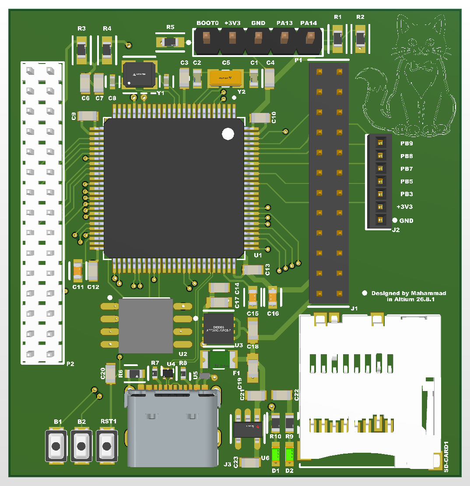
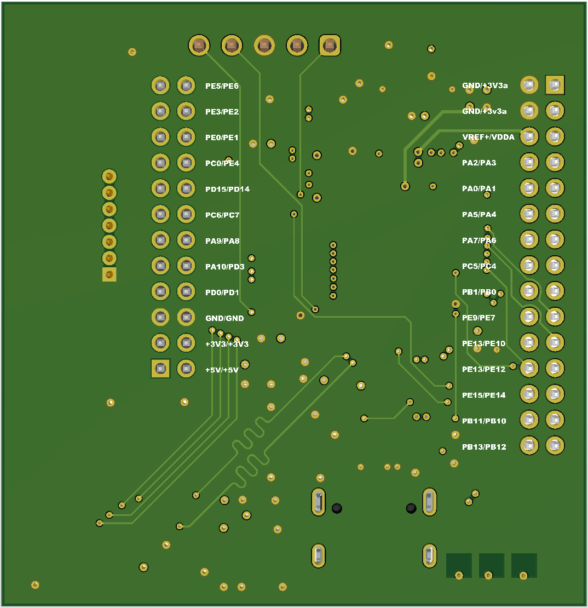

# Stm32-dev-board
6-layer STM32H750 development board designed for embedded systems experimentation.

## Hardware Design Desicions
### STM32H750VBT6 Development Board

### Main MCU

STM32H750VBT6 is probably an overkill for this project. But i used it anyway so i maybe use other pins if need to.
Package: LQFP-100

[Click for more ](docs/HardwareDesignDecisions.md)

## Schematics 

[Schematics](docs/production/STM32H750VBT6schematics.pdf)

## Images

       

